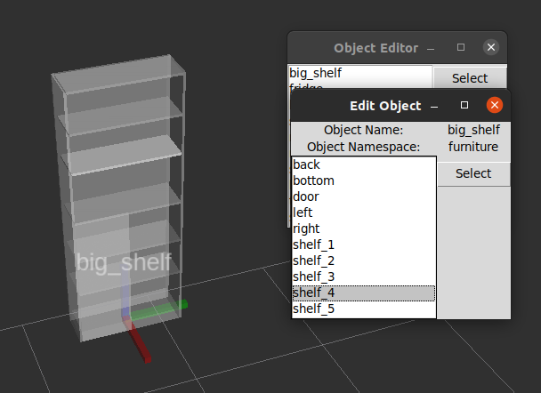

# object-map-server
A object based, geometric world representation system based on [visualization markers](http://docs.ros.org/en/noetic/api/visualization_msgs/html/msg/Marker.html) and [tf](http://wiki.ros.org/tf).

## Edit Object
- Add the topic `/interactive_object_map_server` in your rviz.
- Right click an object and press `edit`

- Press `Select` in the pop up window

- Choose the part you want to edit and press `Select`

- Do your changes and press `Update` to apply them
- Close the `Object Editor` window


## Examples
### Robocup2023 OPL Arena


## Dependencies
 - [Docker](https://www.docker.com/)
 - [Base Image](https://github.com/Maik13579/ros-docker-base-image/tree/master)

## Build
### ROS1 Noetic
```bash
docker-compose -f docker/build.yml build ros
```
### ROS2 Humble
```bash
docker-compose -f docker/build.yml build ros2
```
## Getting started
### ROS1 Noetic
```bash
docker-compose -f docker/ros/docker-compose.yml up
```
### ROS2 Humble
```bash
docker-compose -f docker/ros2/docker-compose.yml up
```

## Authors
 - Maik Knof (maik.knof@gmx.de)
